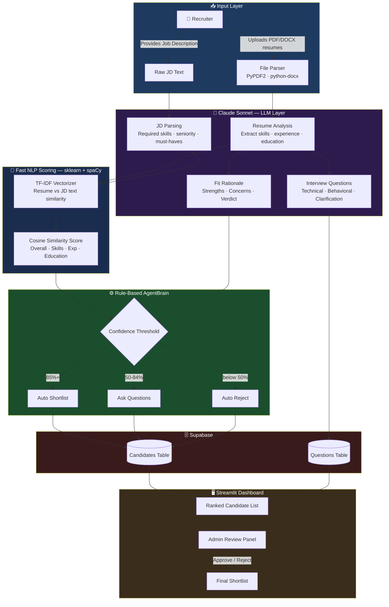
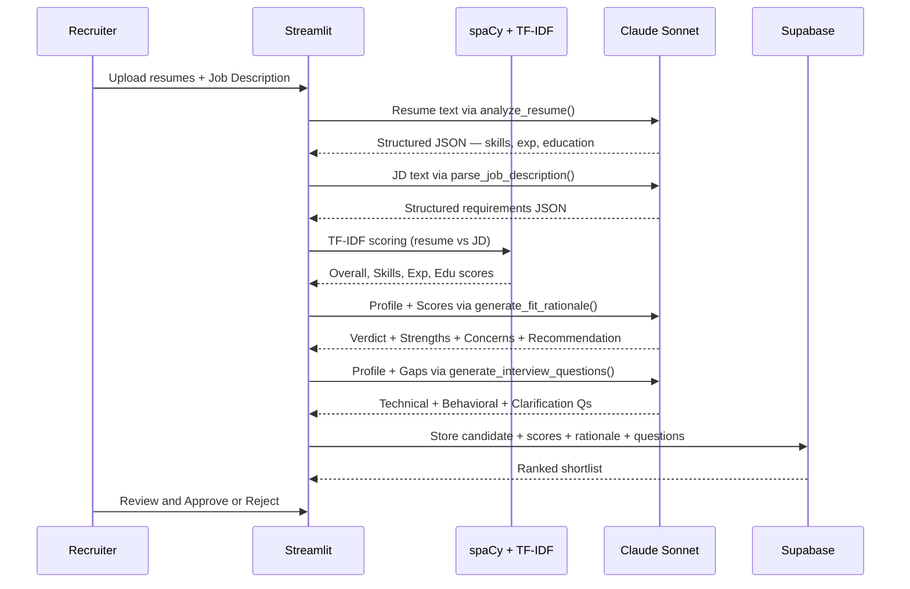

<div align="center">

# 🎯 AI Resume Shortlisting System || [live](https://aisystemusingnlp.streamlit.app/)

### Intelligent Resume Screening & Candidate Ranking — Powered by Claude AI + NLP

[](https://python.org)
[](https://streamlit.io)
[](https://anthropic.com)
[](https://supabase.com)
[](https://spacy.io)
[](https://scikit-learn.org)
[](LICENSE)
[]()

<br/>

> **Hybrid AI pipeline: Claude Sonnet handles semantic understanding (resume parsing, JD analysis, fit rationale, interview Q generation) while TF-IDF + spaCy handle fast keyword-level scoring — combined into a ranked shortlist with explainable decisions.**

</div>

---

## 📌 Problem Statement

Traditional hiring pipelines are:
- ⏳ **Slow** — Manual review of 100s of resumes per role
- 🎲 **Inconsistent** — Human bias affects shortlisting quality
- 🔍 **Shallow** — Keyword matching misses context and relevance
- ❓ **Unexplainable** — No rationale for why a candidate was rejected

This system replaces that workflow with a **hybrid AI pipeline** — fast NLP scoring + deep LLM reasoning — with every decision backed by an explainable rationale.

---

## ✨ Key Features

| Feature | Powered By |
|---|---|
| 📄 Resume Parsing — PDF & DOCX | PyPDF2 + python-docx + **Claude Sonnet** |
| 🧠 Semantic Resume Analysis | **Claude Sonnet** (skills, experience, education extraction) |
| 📋 JD Parsing | **Claude Sonnet** (required skills, seniority, must-haves) |
| 📊 Candidate Scoring & Ranking | TF-IDF + Cosine Similarity (sklearn) + spaCy NLP |
| 🤖 Fit Rationale | **Claude Sonnet** (strengths, concerns, recommendation) |
| ❓ Interview Question Generation | **Claude Sonnet** (technical + behavioral + clarification Qs) |
| 🔐 Admin Approval Workflow | Rule-based AgentBrain (confidence thresholds) |
| 🗄️ Centralized Database | Supabase (PostgreSQL) |
| 📈 Analytics Dashboard | Plotly (score distribution, skill gaps, decision breakdown) |

---

## 🧠 System Architecture



---

## 🔄 Request Flow



---

## 🛠️ Tech Stack

| Layer | Technology | Role |
|---|---|---|
| **LLM** | Claude Sonnet (Anthropic) | Resume parsing, JD analysis, fit rationale, interview Qs |
| **NLP / Scoring** | spaCy + TF-IDF (sklearn) | Keyword extraction, cosine similarity scoring |
| **Frontend** | Streamlit | Dashboard, file upload, admin UI, analytics |
| **Decision Engine** | Rule-based AgentBrain | Confidence thresholds → shortlist / question / reject |
| **File Handling** | PyPDF2, python-docx | Extract text from PDF and DOCX resumes |
| **Database** | Supabase (PostgreSQL) | Candidates, scores, questions, auth |
| **Analytics** | Plotly | Score histograms, skill gap charts, decision pie |

---

## 📂 Project Structure

```
resume-ai-system/
│
├── app.py                    # Streamlit entry point + UI pages
├── claude_integration.py     # Claude API module — all 4 LLM features
├── job_resume_matcher.py     # TF-IDF scoring + spaCy NLP
├── agent_brain.py            # Rule-based decision engine
├── resume_parser.py          # PDF / DOCX text extraction
├── authentication.py         # Supabase auth
├── database.py               # Supabase CRUD operations
├── interview_questions.py    # Interview Q UI component
├── bulk_upload.py            # Batch resume upload
├── ats_resume_validator.py   # ATS validation + feedback
├── email_integration.py      # Email notifications
├── generate_question.py      # Q generation + answer evaluation
├── resources.py              # Cached resource loading
└── requirements.txt
```

---

## ⚙️ Local Setup

```bash
# 1. Clone
git clone https://github.com/TiKkU12345/Resume-Ai-System
cd resume-ai-system

# 2. Install dependencies
pip install -r requirements.txt
python -m spacy download en_core_web_sm

# 3. Set environment variables
# Create .env or add to Streamlit secrets:
ANTHROPIC_API_KEY=your_claude_api_key
SUPABASE_URL=your_supabase_project_url
SUPABASE_KEY=your_supabase_anon_key

# 4. Run
streamlit run app.py
```

---

## 🔐 Environment Variables

```env
ANTHROPIC_API_KEY=sk-ant-...
SUPABASE_URL=https://xxx.supabase.co
SUPABASE_KEY=your_anon_key
```

---

## 🤖 Claude Integration — `claude_integration.py`

Four functions, each calling `claude-sonnet-4-5`:

| Function | Input | Output |
|---|---|---|
| `analyze_resume(text)` | Raw resume text | Structured JSON: skills, experience, education |
| `parse_job_description(text)` | Raw JD text | Required skills, seniority, must-haves |
| `generate_fit_rationale(profile, jd, scores)` | Candidate + JD + scores | Verdict, strengths, concerns, recommendation |
| `generate_interview_questions(profile, jd, scores)` | Candidate + JD + gaps | Technical + behavioral + clarification Qs |

---

## 📊 Analytics Dashboard (Plotly)

- **Decision distribution** — Auto-shortlist vs Questions vs Reject
- **Score distribution** — Candidate score histogram
- **Confidence vs Match Score** — Scatter by decision type
- **Top matched / missing skills** — Horizontal bar charts
- **Experience vs Score** — Scatter with color gradient

---

## 🧑‍💻 Built By

**Arunav Kumar (Tikku)**
[GitHub](https://github.com/TiKkU12345) · [Email](mailto:arunav.jr.0604@gmail.com)

---

<div align="center">

*Hybrid AI system: Claude Sonnet for semantic reasoning + TF-IDF/spaCy for fast scoring — built for placement portfolio demonstrating real-world LLM integration.*

</div>
