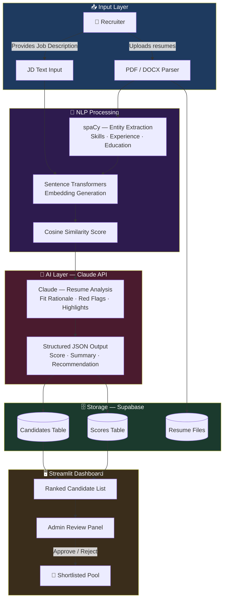
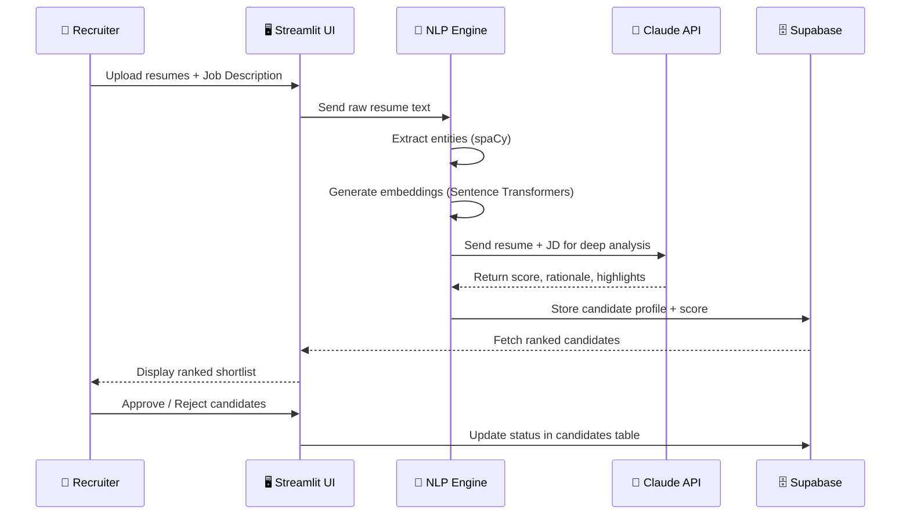
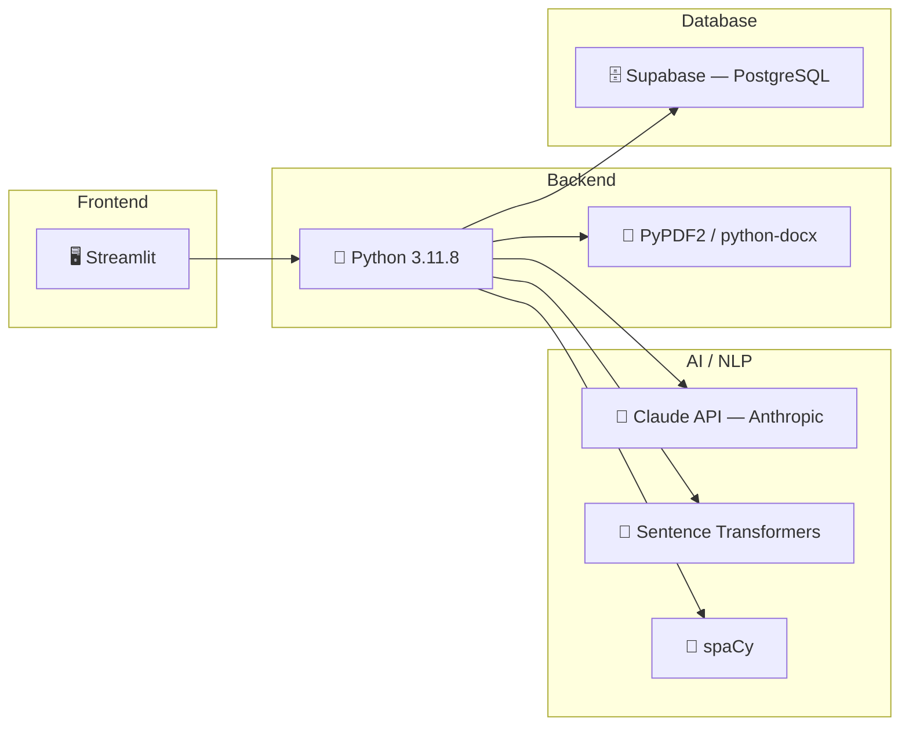

<div align="center">

# 🎯 AI Resume Shortlisting System

### Intelligent Resume Screening & Candidate Ranking — Powered by Claude AI

[](https://python.org)
[](https://streamlit.io)
[](https://anthropic.com)
[](https://supabase.com)
[](https://spacy.io)
[](LICENSE)
[]()

<br/>

> **Automates resume screening using NLP + LLMs — reducing manual effort by ~80% and eliminating keyword-based bias in hiring pipelines.**

</div>

---

## 📌 Problem Statement

Traditional hiring pipelines are:
- ⏳ **Slow** — Manual review of 100s of resumes per role
- 🎲 **Inconsistent** — Human bias affects shortlisting quality
- 🔍 **Shallow** — Keyword matching misses context and relevance

This system replaces that workflow with an **AI-native pipeline** that semantically understands resumes and job descriptions — not just keyword frequency.

---

## ✨ Key Features

| Feature | Description |
|---|---|
| 📄 Resume Parsing | Supports PDF & DOCX formats with text extraction |
| 🧠 Semantic Matching | Sentence Transformers compute embedding-based similarity |
| 🤖 LLM Analysis | Claude API extracts skills, experience, and fit rationale |
| 📊 Candidate Ranking | Scored and ranked automatically by relevance |
| 🔐 Admin Workflow | Manual approval gate before final shortlisting |
| 🗄️ Centralized DB | Supabase stores resumes, scores, and metadata securely |
| ⚡ Real-time UI | Interactive Streamlit dashboard with live filtering |

---

## 🧠 System Architecture



---

## 🔄 Data Flow



---

## 🛠️ Tech Stack



| Layer | Technology | Purpose |
|---|---|---|
| **Frontend** | Streamlit | Dashboard, file upload, admin UI |
| **LLM** | Claude API (Anthropic) | Resume analysis, fit rationale, scoring |
| **NLP** | spaCy + Sentence Transformers | Entity extraction + semantic embeddings |
| **Backend** | Python 3.11.8 | Core processing pipeline |
| **File Handling** | PyPDF2, python-docx | Resume text extraction |
| **Database** | Supabase (PostgreSQL) | Candidate storage, scores, auth |

---

## 📂 Project Structure

```
resume-ai-system/
│
├── app.py                  # Main Streamlit application entry point
├── requirements.txt        # Python dependencies
│
├── components/
│   ├── parser.py           # PDF / DOCX text extraction
│   ├── matcher.py          # Embedding generation + cosine similarity
│   ├── llm_analyzer.py     # Claude API integration
│   └── admin.py            # Admin approval workflow
│
├── database/
│   ├── supabase_client.py  # DB connection + queries
│   └── schema.sql          # Table definitions
│
└── utils/
    └── config.py           # Environment variables, constants
```

---

## ⚙️ Local Setup

```bash
# 1. Clone the repo
git clone https://github.com/TiKkU12345/resume-ai-system
cd resume-ai-system

# 2. Install dependencies
pip install -r requirements.txt

# 3. Set environment variables
cp .env.example .env
# Add: ANTHROPIC_API_KEY, SUPABASE_URL, SUPABASE_KEY

# 4. Run
streamlit run app.py
```

---

## 🔐 Environment Variables

```env
ANTHROPIC_API_KEY=your_claude_api_key
SUPABASE_URL=your_supabase_project_url
SUPABASE_KEY=your_supabase_anon_key
```

---

## 📊 Pipeline Performance (Approximate)

| Metric | Value |
|---|---|
| Avg. screening time per resume | ~3–5 seconds |
| Manual effort reduction | ~80% |
| Supported file formats | PDF, DOCX |
| Max batch size tested | 50 resumes |

---

## 🧑‍💻 Built By

**Arunav Kumar (Tikku)**
[GitHub](https://github.com/TiKkU12345) · [Email](mailto:arunav.jr.0604@gmail.com)

---

<div align="center">

*Built for placement portfolio — demonstrating end-to-end AI/ML system design with real-world utility.*

</div>
